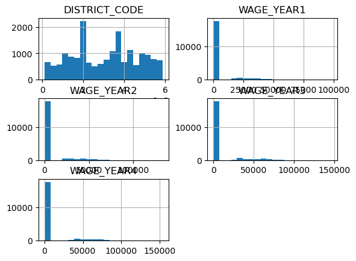

# x62-data-challenge-student-pathways

## Data quality: 
For each feature (column), what is the data type? Is there any missing data?

Data types:

```python
df.type()

DISTRICT_TYPE          object
DISTRICT_NAME          object
DISTRICT_CODE         float64
ACADEMIC_YEAR          object
DEMO_CATEGORY          object
STUDENT_POPULATION     object
AWARD_CATEGORY         object
WAGE_YEAR1            float64
WAGE_YEAR2            float64
WAGE_YEAR3            float64
WAGE_YEAR4            float64
dtype: object
```


Missing data?:

```python
df.isnull().sum()

DISTRICT_TYPE            0
DISTRICT_NAME            0
DISTRICT_CODE         2745
ACADEMIC_YEAR            0
DEMO_CATEGORY            0
STUDENT_POPULATION       0
AWARD_CATEGORY           0
WAGE_YEAR1               0
WAGE_YEAR2               0
WAGE_YEAR3               0
WAGE_YEAR4               0
dtype: int64
```
DISTRICT_CODE has 2745 entries of null / missing data


## Range: 
What are the unique values for each categorical column? 

```python
for col in df.select_dtypes(include="object"):
    print(col, ":", df[col].unique())

DISTRICT_TYPE : ['School District' 'Legislative District' 'All']
DISTRICT_NAME : ['Duarte Unified' 'Coronado Unified' 'Gilroy Unified' ...]
ACADEMIC_YEAR : ['2018-2019']
DEMO_CATEGORY : ['Race' 'Homeless Status' 'All' 'Foster Status' 'Gender']
STUDENT_POPULATION : ['None Reported' 'Black or African American'
 'Did Not Experience Homelessness in K-12'
 'American Indian or Alaska Native'
 'Native Hawaiian or Other Pacific Islander' 'All' 'Two or More Races'
 'Foster Youth' 'Female' 'White' 'Experienced Homelessness in K-12'
 'Not Foster Youth' 'Male' 'Asian' 'Hispanic or Latino']
AWARD_CATEGORY : ["Bachelor's Degree - Did Not Transfer" 'Associate Degree'
 'Community College Certificate' "Bachelor's Degree - Transferred"]
```


What is the range of values of the numeric columns? 

```python
df.describe()


		DISTRICT_CODE	WAGE_YEAR1		WAGE_YEAR2		WAGE_YEAR3		WAGE_YEAR4
count	1.796000e+04	20705.000000	20705.000000	20705.000000	20705.000000
mean	3.041331e+06	4476.106834		6075.533253		7310.831635		8530.890413
std		1.583286e+06	11944.502346	16140.916903	19158.203471	22106.663179
min		1.100170e+05	0.000000		0.000000		0.000000		0.000000
25%		1.864089e+06	0.000000		0.000000		0.000000		0.000000
50%		3.166852e+06	0.000000		0.000000		0.000000		0.000000
75%		4.277214e+06	0.000000		0.000000		0.000000		0.000000
max		5.872769e+06	97993.000000	132847.000000	146728.000000	153910.000000

```


Are the numeric column values normally distributed?

```python
df.describe()
```


The graphs do not show a normal distribution.


## Semantics: 
What is the meaning of the columns? 

DISTRICT_TYPE: What type of district the data was taken from
DISTRICT_NAME: What the name of the school district is
DISTRICT_CODE: What is the given school districts code (identifier?)
ACADEMIC_YEAR: What school year the data was collected
DEMO_CATEGORY: What category of demographic was used to group students in the data
STUDENT_POPULATION: The specific demographic group being described
AWARD_CATEGORY: (average?) level of award earned after high-school
WAGE_YEAR1 - WAGE_YEAR4: Average wages of students from the given group during their time at high-school


Are any columns related to other columns? (If so, how?)

```python
df.corr(numeric_only=True)

				DISTRICT_CODE	WAGE_YEAR1	WAGE_YEAR2	WAGE_YEAR3	WAGE_YEAR4
DISTRICT_CODE	1.000000		-0.003839	-0.004325	-0.003590	-0.001438
WAGE_YEAR1		-0.003839		1.000000	0.990263	0.986502	0.981711
WAGE_YEAR2		-0.004325		0.990263	1.000000	0.992555	0.987440
WAGE_YEAR3		-0.003590		0.986502	0.992555	1.000000	0.993653
WAGE_YEAR4		-0.001438		0.981711	0.987440	0.993653	1.000000
```
Wages from year 1 to year 4 are strongly correlated but district code does not appear to be correlated with wages.


## If you are enrolled in CS 562, also provide answers to the following:
Which demographic shows the highest WAGE_YEAR3? Which demographic shows the lowest WAGE_YEAR3?


Are there any people with negative wage trends? Describe these people by their
demographics.


Are there any people with positive wage trends? Describe these people by their
demographics.